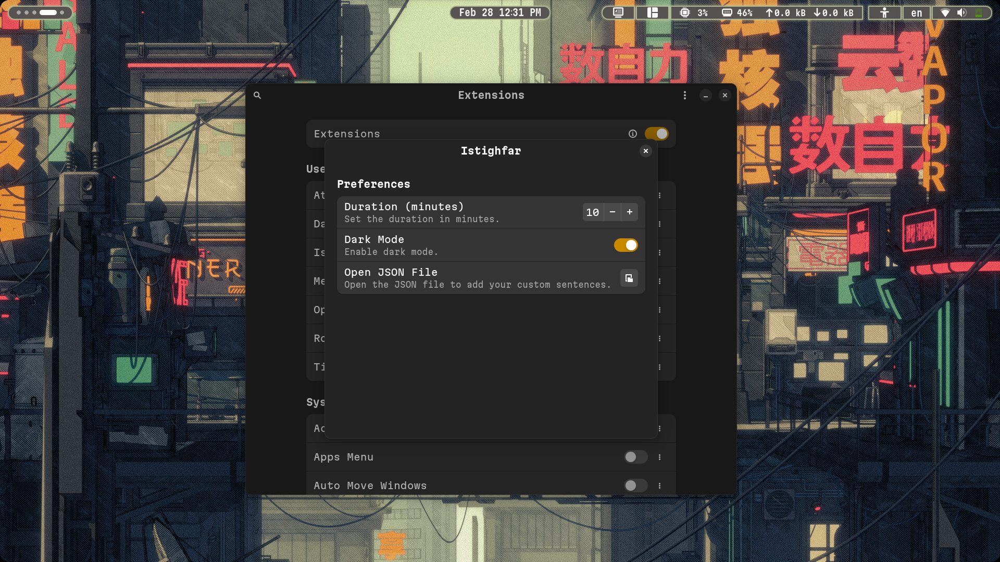
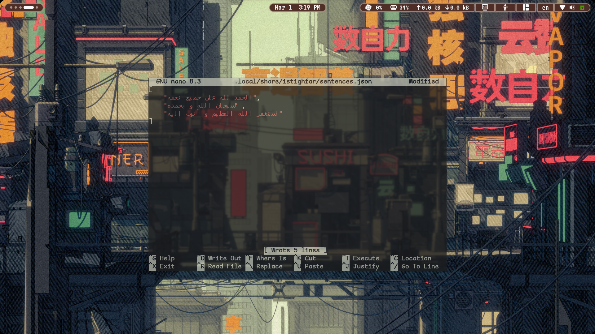
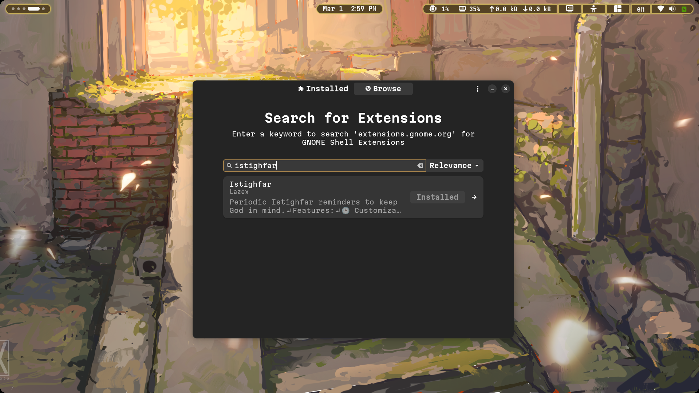

# Istighfar Extension

A GNOME Shell extension that provides customizable Istighfar reminders. This extension lets you set a reminder duration, customize sentences via a JSON file, and toggle a dark mode interface.

## Features

- **Customizable Duration:** Set the reminder interval (in minutes).
- **Dark Mode:** Toggle a dark-themed interface.
- **Editable Sentences:** Open and modify a JSON file to add your own custom sentences.
- **Localized UI:** Supports translations.


## How does it look:


### settings:



### editing the sentences.json file:



## How to install

### Install from extensions.gnome.org (Recommended)

[](https://extensions.gnome.org/extension/7902/istighfar/)

you can use extensions-manager:

[](https://github.com/mjakeman/extension-manager)

### Manual installation
clone this repo:
```
  git clone https://github.com/L4z3x/Istighfar-gnome-extension/
  cd Istighfar-gnome-extension
```
run the install.sh script:
```
  ./install.sh
```
reload gnome-shell by pressing Alt+f2 then typing 'r' or simply logout and login.
## Doesn't look good on your screen:
open stylesheet.css and adjust font-size value (line 18) and then reload te gnome-shell by logging out
```
  cd "$HOME/.local/share/gnome-shell/extensions/istighfar@islamic.dikra.lazaal"
  nano stylesheet.css
```
## give this repo a star if you enjoyed this extension
